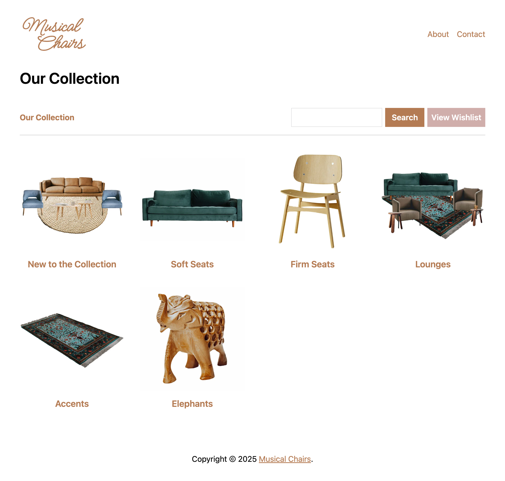

# RWE Static Inventory Gallery

This starter template can be used to build a static HTML page containing your rental inventory using the RW Elephant Online Gallery Snippet.

The kit comes with the Online Gallery Snippet set up. You will need to add your RW Elephant `tenant_id` and `public_api_key`.

**Rental Categories:**

**Category Items:**

**Single Item:**

**Wishlist:**

**Submit Wishlist:**

